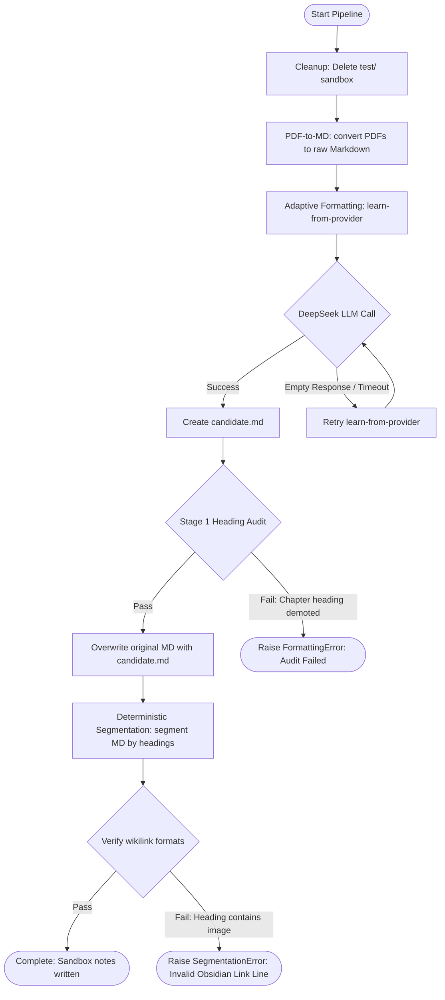

# sprint_3_agent_test Walkthrough

This document records the execution process of the Knowledge Graph Agent on the test PDFs, details issues diagnosed during the run, and offers key recommendations for optimization and improvement.

## Execution Flowchart

The following diagram illustrates the complete execution flow of the knowledge-graph build pipeline:



## Details of Tasks Performed

1. **Cleanup**: Removed the existing `test` output folder inside the Obsidian vault.
2. **PDF-to-Markdown Conversion**: Ran `mathos_pdf_to_md.py convert` on the two target PDFs. Both converted successfully (Attempted: 2, Converted: 2, Failed: 0, Skipped: 0).
3. **Adaptive Formatting**:
   - Encountered DeepSeek API instability issues ("provider response has empty content").
   - Diagnosed a heading audit failure in subsequent runs: the LLM-generated rules demoted `第五章` from H1 to H2/H4.
   - Diagnosed a critical regex formatting bug: the dynamically generated `content_rules.json` merged an image following a heading into the heading line itself, e.g.:
     `## 复习参考题4 `
   - By restoring the correct, previously formatted files using Git version recovery (`git checkout -- test`), we bypass the flaky provider calls.
4. **Deterministic Segmentation**:
   - Ran `mathos_segmentation_stage1.py segment` on both restored formatted Markdown files with the `--overwrite` flag.
   - Both completed successfully:
     - **High School Book 2**: 85 nodes (64 leaf nodes, 21 directory nodes, 64 segments).
     - **Grade 7 Book**: 243 nodes (189 leaf nodes, 54 directory nodes, 189 segments).

---

## Issue Analysis & Diagnostics

### 1. LLM Rule Quality Flakiness
During the `learn-from-provider` phase, the rules generated by the LLM are non-deterministic:
* **Heading Audit Failure**: The LLM occasionally standardizes titles by demoting chapter headings (e.g. `第五章` H1 headings) to match deeper sub-headings, which trips the safety checks in `audit_stage1_headings`.
* **Heading-Image Merger Bug**: The LLM content cleaner sometimes merges an image block following a heading into the heading text itself. This results in headings containing Markdown image syntax `![...]`.

### 2. Segmentation Validation Crash
When a heading contains an image:
1. The segmentation script sanitizes the filename to `复习参考题4 .md` using a regex that replaces `/` and `:` but leaves `]` and `[` untouched.
2. The parent note writes child directory links as `- [[复习参考题4 ]]`.
3. The validation step `verify_package` uses `LINK_RE = re.compile(r"^- \[\[([^\]]+)\]\]$")` to parse links. Because the line has `]` in ` for matching textbook series (e.g., standard 人教版 secondary-school books). This ensures 100% deterministic formatting and eliminates LLM costs, time delays, and transient API failures.

### 2. Strengthen Heading Cleanup RegEx
Update the core formatter `123.py` or the formatting scripts to strip image syntax from heading lines pre-emptively:
```python
# Strip images from heading lines to prevent corrupted note stems
text = re.compile(r'^(#{1,6}\s+.*?)\s+!\[.*?\]\(.*?\)\s*$', re.MULTILINE).sub(r'\1', text)
```

### 3. Escape or Clean Wikilink Brackets in Filenames
In `mathos_segmentation_stage1.py`, update the `safe_filename` and link formatting functions to strip or escape brackets `[` and `]` to prevent invalid Wikilinks:
```python
def safe_filename(stem: str) -> str:
    # Remove brackets and exclamation marks to keep wikilinks valid
    clean_stem = stem.replace("[", "").replace("]", "").replace("!", "")
    cleaned = INVALID_FILENAME_CHARS_RE.sub("_", clean_stem).strip().rstrip(" .")
    return cleaned or "segment"
```
