# Project Understanding: MathOS

Generated after reading the workspace on 2026-06-04.

## 1. Directory Structure

The workspace root `C:\mygithub` contains two related repositories:

```text
C:\mygithub
├── .env                                      # shared private runtime config, not part of either repo
├── Mathematics-Knowledge-code                # code, automation, docs, tests, local Codex skills
└── Secondary-School-Mathematics-Knowledge-Map# large Obsidian-style mathematics knowledge base
```

`Mathematics-Knowledge-code` is the automation/code repository:

```text
Mathematics-Knowledge-code
├── AGENTS.md                 # Codex/project safety rules
├── README.md                 # high-level MathOS architecture
├── pyproject.toml            # package metadata and console script declarations
├── requirements.txt          # minimal runtime requirements
├── .env.example              # example shared config
├── src/mathos                # Python package
│   ├── schemas               # Pydantic data contracts
│   ├── ingestion/mineru      # MinerU PDF/DOCX to Markdown ingestion
│   ├── formatter             # Markdown formatter subsystem
│   ├── chunking              # Markdown chunk parser and categorizer
│   ├── vault                 # intended Obsidian vault builder
│   ├── extraction            # DeepSeek candidate extraction
│   ├── ontology              # candidate merge and Neo4j CSV export
│   ├── projection            # Obsidian wikilink weaving and canvas generation
│   └── cli                   # currently empty package-level CLI module
├── tools                     # PowerShell wrappers for common commands
├── skills                    # repo-local Codex skills/SOPs for each pipeline stage
├── tests                     # pytest tests, currently formatter/rule-builder focused
├── docs                      # architecture, formatter, MinerU, and planning docs
└── automation/prompts        # reusable automation prompts
```

`Secondary-School-Mathematics-Knowledge-Map` is the target data/content repository:

```text
Secondary-School-Mathematics-Knowledge-Map
├── .obsidian
├── 初中
├── 高中
├── book
├── images
└── MathLogic-Weave
```

Approximate content-vault scale observed:

- Total files: about 260k.
- Dominant file types: `.jpg`, `.png`, `.md`, `.docx`, `.pptx`.
- Major folders: `初中`, `高中`, `book`, `images`, `.obsidian`.

Per `AGENTS.md`, code work should happen in `Mathematics-Knowledge-code`. The knowledge-base repository should only be edited when the user explicitly asks for content changes or runs a formatter/conversion command that targets it.

## 2. Entry Files

Implemented CLI entry files:

- `src/mathos/formatter/cli.py`
  - Console command: `mk-format`
  - Supports `--dir`, `--mode`, `--backup`, `--dry-run`, and `--toc-lines`.
  - If no mode is supplied, it can launch the interactive LLM-backed rule builder.

- `src/mathos/ingestion/mineru/cli.py`
  - Console command: `mk-mineru`
  - Recursively scans PDF/DOCX sources, sends them to MinerU, writes Markdown to the knowledge-base repo, then optionally formats the output subtree.

- `src/mathos/ingestion/mineru/batch_parser/main.py`
  - Thin module entry that delegates to `mathos.ingestion.mineru.cli.main`.

- `profile_formatter.py`
  - Standalone profiling helper.

Declared but currently not implemented or incomplete according to import checks:

- `math-knowledge = mathos.cli:main`
  - `mathos.cli` imports, but `main` is missing.
- `mk-vault = mathos.vault.cli:main`
  - `mathos.vault.cli` is missing.
- `mk-extract = mathos.extraction.cli:main`
  - `mathos.extraction.cli` is missing.
- `mk-graph = mathos.projection.graph_backend.cli:main`
  - `mathos.projection.graph_backend` is missing.
- `mk-obsidian = mathos.obsidian_integration.cli:main`
  - `mathos.obsidian_integration` is missing.

## 3. Core Modules

### Schemas

Path: `src/mathos/schemas`

These are the intended strong data contracts for the data-first pipeline:

- `Chunk`: logical Markdown block with title, content, and heading level.
- `AtomicNote`: physical Obsidian note with title, content, hierarchy, and links.
- `Candidate`: raw LLM-extracted concept with category, description, prerequisites, and source metadata.
- `KnowledgeObject`: globally merged graph node with JSON-LD-style aliases for `@context`, `@id`, and `@type`.

### Ingestion

Path: `src/mathos/ingestion/mineru`

Main responsibilities:

- Load env/config from `MATH_KNOWLEDGE_ENV`, repo `.env`, parent `C:\mygithub\.env`, or shell environment.
- Scan source folders for PDF/DOCX files.
- Split large PDFs with PyMuPDF.
- Request MinerU batch upload URLs.
- Upload files, poll results, download ZIP outputs.
- Safely extract ZIP members.
- Merge `full.md` files and copy image assets.
- Optionally run the formatter against the actual output subtree.

Important files:

- `config.py`: env loading and defaults.
- `cli.py`: CLI parser and post-format orchestration.
- `batch_parser/file_utils.py`: scanning, safe output path construction, PDF splitting, Markdown merge.
- `batch_parser/processor.py`: threaded batch processing and polling.
- `core/client.py`: MinerU HTTP client with retry logic and safe ZIP extraction.
- `core/endpoints.py`: MinerU endpoint construction.

### Formatter

Path: `src/mathos/formatter`

This is the most complete current subsystem.

Main responsibilities:

- Apply Markdown cleanup rules to the knowledge base.
- Preserve formulas and improve OCR/MinerU output.
- Normalize textbook headings, callouts, examples, images, captions, tables, and option formatting.
- Support dry-run and backup workflows.
- Discover formatter modes dynamically from `BaseFormatter` subclasses.
- Generate new formatter classes through a two-phase DeepSeek-backed rule builder.

Important files:

- `core.py`: `BaseFormatter`, common regex cleanup, per-file processing, backups, dry-run.
- `discovery.py`: scans the formatter package and maps `CamelCaseFormatter` to kebab-case modes.
- `cli.py`: `mk-format` entry point.
- `textbook.py`: broad textbook formatter.
- `renjiao_highschool_textbook.py`: 人教版高中教材 formatter.
- `rule_builder.py`: interactive LLM formatter generator with AST validation.
- `prompts/*.md`: prompt templates for heading rules and beautification.

Currently discovered formatter modes:

- `renjiao-highschool-textbook`
- `textbook`

Some docs/wrappers still mention modes such as `exercise`, `yishu`, `bishua`, and `all_exercises`; those modes are not currently discovered from the source tree.

### Chunking

Path: `src/mathos/chunking`

Main responsibilities:

- Parse clean Markdown into logical chunks.
- Preserve RKDT-style heading hierarchy.
- Treat Obsidian callouts as atomic chunks.
- Categorize chunks into physical knowledge categories.

Important files:

- `chunker.py`: `MarkdownChunker`, heading/callout parser.
- `categorizer.py`: maps callout types to categories such as `题` and `思维或技巧`.

### Vault

Path: `src/mathos/vault`

Intended responsibility:

- Convert parsed chunks into a nested Obsidian vault while preserving physical hierarchy.

Current implementation note:

- `vault_builder.py` exists, but import smoke testing fails because it imports `.categorizer` and `.vault_models`, while those modules are not present under `mathos.vault`.
- `Categorizer` exists under `mathos.chunking.categorizer`, suggesting the vault module may be mid-refactor.

### Extraction

Path: `src/mathos/extraction`

Main responsibilities:

- Read Markdown notes.
- Use DeepSeek via the OpenAI-compatible client to extract mathematical concepts, formulas, theorems, categories, descriptions, and prerequisites.
- Write side-car `*.candidates.json` files into sibling `*candidates` directories without modifying source Markdown.

Important files:

- `extractor.py`: `DeepSeekExtractor`.
- `batch_runner.py`: `OntologyBatchRunner`.

### Ontology

Path: `src/mathos/ontology`

Main responsibilities:

- Collect side-car candidate JSON files.
- Merge duplicate concepts by exact name.
- Merge prerequisites and keep longer descriptions.
- Preserve source provenance.
- Export nodes/edges CSVs for Neo4j or GraphRAG workflows.

Important files:

- `global_merger.py`: `GlobalMerger`.
- `neo4j_exporter.py`: `Neo4jExporter`.

### Projection

Path: `src/mathos/projection`

Main responsibilities:

- Project ontology results back into Obsidian-facing artifacts.
- Inject safe `[[wikilinks]]` into Markdown while skipping code, formulas, and existing links.
- Build Obsidian JSON Canvas files that combine physical file tree nodes with concept star clusters.

Important files:

- `weaver.py`: `KnowledgeWeaver`.
- `canvas_builder.py`: `HybridCanvasBuilder`.

### Skills

Path: `skills`

Repo-local Codex skills mirror the pipeline stages:

- `convert-with-mineru`
- `mathos-formatter`
- `chunk-markdown`
- `build-vault`
- `extract-candidate`
- `build-ontology`
- `weave-links`
- `build-canvas`
- `building-zettelkasten-from-markdown`

These serve as SOPs for AI-assisted operation of the codebase.

## 4. Configuration Files

Primary configuration and metadata:

- `pyproject.toml`
  - Package name: `mathematics-knowledge-tools`.
  - Source layout: `src`.
  - Python: `>=3.10`.
  - Declares console scripts.
  - Pytest config sets `pythonpath = ["src"]` and `testpaths = ["tests"]`.

- `requirements.txt`
  - `requests`
  - `PyMuPDF`
  - `python-dotenv`

- `.env.example`
  - `MINERU_API_KEY`
  - `BASE_URL`
  - `KNOWLEDGE_BASE_DIR`
  - `SOURCE_MATERIALS_DIR`
  - `MAX_PARALLEL_TASKS`
  - `MAX_PAGES_PER_CHUNK`
  - `POLL_INTERVAL`
  - `MAX_RETRIES`

- `C:\mygithub\.env`
  - Shared private runtime config exists at workspace root.
  - Its values were not included here to avoid exposing secrets.

- `.gitignore`
  - Repository ignore rules.

- `AGENTS.md`
  - Operational safety rules and canonical commands.

- `docs/commands.md`
  - Command examples and intended CLI usage.

Potential dependency gap:

- Source imports `pydantic` and `openai`, but these are not listed in `pyproject.toml` or `requirements.txt`.

## 5. Data Flow

The intended MathOS pipeline is data-first:

```text
PDF/DOCX
  -> MinerU ingestion
  -> raw Markdown + images
  -> formatter cleanup
  -> clean Markdown
  -> chunking
  -> AtomicNote vault files
  -> DeepSeek candidate extraction
  -> side-car candidates JSON
  -> global ontology merge
  -> graph/projection outputs
  -> Obsidian wikilinks, Canvas, Neo4j CSVs
```

More concretely:

1. Source documents are scanned by `scan_directory`.
2. `Processor` splits oversized PDFs, uploads batches through `MinerUClient`, polls extraction status, downloads ZIP outputs, and merges `full.md` plus images.
3. `mk-mineru --format <mode>` can call `run_formatter` on the generated output subtree.
4. `MarkdownChunker` parses clean Markdown into text/callout chunks with `parent_hierarchy`.
5. `VaultBuilder` is intended to create nested Obsidian files, but currently has import gaps.
6. `OntologyBatchRunner` sends vault Markdown notes to `DeepSeekExtractor`.
7. Candidate JSON files are written as side-car files under `*candidates` directories.
8. `GlobalMerger` collects and merges candidates into `global_ontology.json`.
9. `Neo4jExporter` writes `nodes.csv` and `edges.csv`.
10. `KnowledgeWeaver` injects once-per-file wikilinks while protecting LaTeX/code/existing links.
11. `HybridCanvasBuilder` emits Obsidian `.canvas` JSON combining file-tree and concept nodes.

## 6. Inferred Project Functionality

MathOS is a local knowledge-engineering operating system for a secondary-school mathematics Obsidian vault. It is designed to turn textbook/source materials into structured Markdown, split that Markdown into a physically nested knowledge vault, extract mathematical entities and prerequisite relationships with an LLM, merge them into a global ontology, and project the result back into Obsidian and graph backends.

In practical terms, it supports three broad workflows:

- Ingest: convert PDF/DOCX teaching materials into Markdown using MinerU.
- Clean: normalize OCR/MinerU Markdown into readable, formula-preserving textbook notes.
- Build graph: chunk, extract candidates, merge ontology, weave links, and generate visualization/export artifacts.

The current codebase is partly complete:

- Formatter and MinerU ingestion are implemented and import successfully.
- Schema, extraction, ontology, and projection modules are present.
- Several stage CLIs are declared or documented but not yet implemented.
- Vault building appears mid-refactor because required imports are missing.
- Some docs preserve historical names or planned commands that do not match the current `mathos` source tree.

## 7. Architecture Diagram

```mermaid
flowchart LR
    A["Source PDF/DOCX<br/>external source folders"] --> B["MinerU ingestion<br/>mathos.ingestion.mineru"]
    B --> C["Raw Markdown + images<br/>knowledge-base repo"]
    C --> D["Formatter<br/>mathos.formatter"]
    D --> E["Clean Markdown"]
    E --> F["Chunker<br/>mathos.chunking"]
    F --> G["Chunks with parent_hierarchy"]
    G --> H["Vault Builder<br/>mathos.vault<br/>(currently import gaps)"]
    H --> I["Atomic Obsidian notes<br/>nested RKDT folders"]
    I --> J["DeepSeek extraction<br/>mathos.extraction"]
    J --> K["Side-car candidates JSON<br/>*candidates/*.candidates.json"]
    K --> L["Global ontology merge<br/>mathos.ontology"]
    L --> M["global_ontology.json"]
    M --> N["Neo4j CSV export<br/>nodes.csv + edges.csv"]
    M --> O["Wikilink weaving<br/>mathos.projection.weaver"]
    M --> P["Obsidian Canvas<br/>mathos.projection.canvas_builder"]
    O --> I
    P --> Q[".canvas visualization"]

    R["schemas<br/>Chunk / AtomicNote / Candidate / KnowledgeObject"] -. "data contracts" .-> F
    R -. "data contracts" .-> H
    R -. "data contracts" .-> J
    R -. "data contracts" .-> L
```



## 8. Project Reading Path

Recommended reading order for a new engineer or agent:

1. `AGENTS.md`
   - Learn safety rules, target repositories, and canonical commands.

2. `README.md`
   - Understand MathOS philosophy, pipeline, and the Schemas + Skills + Src architecture.

3. `docs/architecture/MathOS_System_Design.md`
   - Read the intended end-to-end pipeline and stage responsibilities.

4. `pyproject.toml`
   - Check package metadata, dependencies, pytest config, and declared console scripts.

5. `src/mathos/schemas/*.py`
   - Learn the data contracts before reading pipeline modules.

6. `src/mathos/formatter/core.py`
   - Understand common Markdown cleanup behavior.

7. `src/mathos/formatter/discovery.py`
   - Understand formatter mode discovery.

8. `src/mathos/formatter/cli.py`
   - Understand the most mature CLI entry point.

9. `src/mathos/formatter/textbook.py`, `renjiao_highschool_textbook.py`
   - Study concrete formatter implementations.

10. `src/mathos/ingestion/mineru/config.py`
    - Understand environment loading and default paths.

11. `src/mathos/ingestion/mineru/cli.py`
    - Understand MinerU command orchestration.

12. `src/mathos/ingestion/mineru/batch_parser/*.py` and `core/*.py`
    - Read scanning, safe output paths, splitting, upload/poll/download, and merge logic.

13. `src/mathos/chunking/chunker.py` and `categorizer.py`
    - Understand Markdown-to-chunk parsing and category assignment.

14. `src/mathos/vault/vault_builder.py`
    - Read intended vault construction, while noting current import gaps.

15. `src/mathos/extraction/*.py`
    - Understand side-car JSON candidate extraction.

16. `src/mathos/ontology/*.py`
    - Understand merge and graph export behavior.

17. `src/mathos/projection/*.py`
    - Understand Obsidian wikilink and canvas projections.

18. `tests/*.py`
    - Review current behavioral coverage.

19. `skills/*/SKILL.md`
    - Read the SOP for whichever pipeline stage you intend to operate.

20. `docs/commands.md` and historical planning docs
    - Use as context, but verify against current source because some commands/modes are ahead of implementation.

## 9. Verified Observations

Commands/checks performed during this read-through:

- Listed workspace and both repositories.
- Enumerated source files with `rg --files`.
- Read `AGENTS.md`, `README.md`, `pyproject.toml`, `.env.example`, major docs, tools, tests, and core source modules.
- Checked formatter discovery through Python.
- Checked import availability for implemented and declared CLI targets.
- Checked Git status for both repositories.

Important current-state observations:

- `C:\mygithub` itself is not a Git repo.
- `Mathematics-Knowledge-code` has an untracked `test_rule_builder_script.py` before this document was created.
- `Secondary-School-Mathematics-Knowledge-Map` has pre-existing modified/untracked content files.
- No content-vault files were modified during this analysis.
- This document is the only file intentionally created for the requested project understanding artifact.
